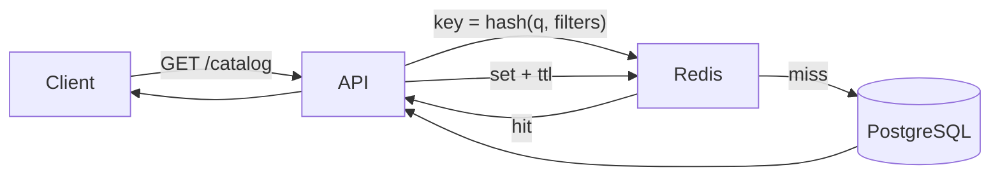

# Architecture notes — Caching layer

_Status: **proposed** · Author: Donald Jackson · 2026-06-02_

## Context

Read latency on the product catalog endpoint has crept up from p50=40 ms
to p50=180 ms over the last quarter as traffic doubled. The hot path is
a 4-table join that the query planner can no longer fold into a single
seek. We've already tuned indexes; what's left is to put a cache in
front of it.

> The goal is **not** to make the slow query faster — it's to never run
> it again for the same input within a short window.

## Proposed design

A read-through cache between the API handler and the database, keyed by
a normalized view of the query parameters. Cache entries live in Redis
with an LRU policy and a short TTL.



### Key shape

The cache key is a SHA-1 of the canonicalized request:

```text
catalog:v2:{sha1(sorted(filters)) + locale + page}
```

The `v2` prefix lets us invalidate everything by bumping it — useful
when the schema changes.

## Trade-offs

| Option | p50 | p99 | Stale risk | Ops cost |
|--------|----:|----:|:----------:|:--------:|
| No cache (today)      | 180 ms | 2.4 s | none   | low  |
| Read-through (proposed) | ~15 ms | ~80 ms | ≤ TTL | medium |
| Materialized view       | ~30 ms | ~110 ms | minutes | high |
| CDN at the edge         |  ~5 ms | ~20 ms | minutes | high |

The CDN option is tempting but assumes anonymous, identical responses —
not true for our logged-in catalog where pricing varies by tier.

## Risks

- **Thundering herd on miss.** Mitigate with single-flight: only one
  in-flight DB read per key; the rest wait on the result.
- **TTL too long.** A 5-minute TTL feels right for now; product can
  page a force-invalidate from the admin tool if needed.
- **Cache stampede on deploy.** Pre-warm the top 200 keys from
  yesterday's access log during rollout.

## Rollout

- [x] Land Redis client + key normalization
- [x] Wire cache wrapper around the handler
- [ ] Add `cache_status` header (HIT/MISS/BYPASS) for observability
- [ ] Single-flight protection
- [ ] Pre-warm script in deploy pipeline
- [ ] Dashboard: hit rate, key cardinality, p50/p99 split by status

## Open questions

1. Do we need per-tenant cache namespaces, or is the tier in the key
   sufficient?
2. Should `force_refresh=true` bypass the cache, or also invalidate?
3. What's our policy when Redis is down? Fail open (DB-only) or fail
   closed (503)?

See also: [Redis docs on key expiration](https://redis.io/docs/manual/keyspace-notifications/),
[Caffeine's single-flight pattern](https://github.com/ben-manes/caffeine/wiki).
